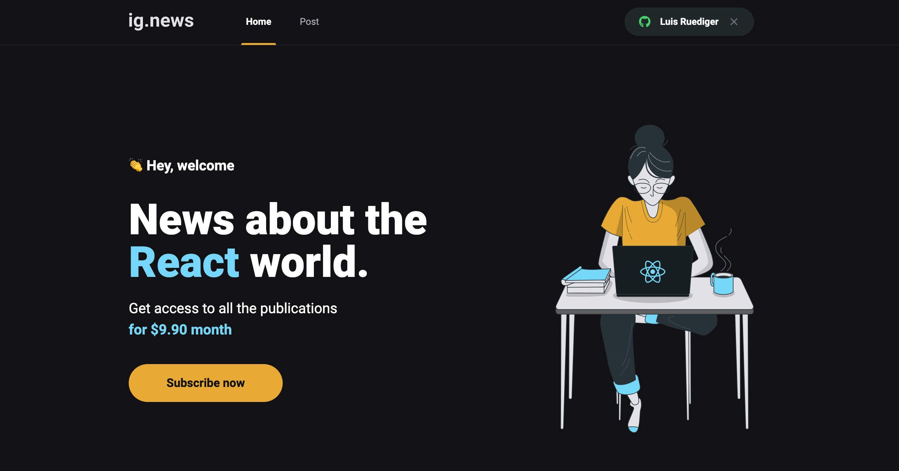

# IG.News 
 
Projeto IG.News é um blog de assinatura, onde posts são exibidos ao usuário caso ele tenha uma assinatura ativa. O projeto tem integração com o Stripe e login social com o Github. Desenvolvido durante as aulas do Ignite @Rocketseat. 
> Para ver o projeto rodando você pode acessar este [Link](link.com.br).

---

  

---
## Funcionalidades

- [x] Login com Github.
- [x] Integração com api de pagamento do Stripe, para novas assinaturas e validação de assinatura ativa.
- [x] Integração com o Prismic CMS, para edição de posts.
- [x] Testes automatizados com Jest.

---

## Tecnologias

- [`Typescript`](https://www.typescriptlang.org/docs/)
- [`Next.js`](https://nextjs.org/)
- [`React`](https://pt-br.reactjs.org/)
- [`SASS`](https://sass-lang.com/)
- [`Prismic`](https://prismic.io/)
- [`Stripe`](https://stripe.com/br)
- [`FaunaDB`](https://fauna.com/)
- [`Axios`](https://axios-http.com/ptbr/docs/intro)
